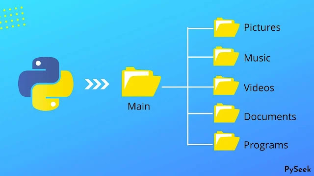

<div align="center">

# 📁 Downloads folder organizer

**[O'zbek tilida 🇺🇿](README_UZ.md)** | **[In English 🇬🇧](README.md)**

**Automatically organize your Downloads folder by sorting files into subfolders based on their file type**



[](https://www.python.org/downloads/)
[](LICENSE)
[](https://github.com/psf/black)


</div>

---

Python script that automatically organizes files in your Downloads folder by sorting them into subfolders based on their file type. Uses only Python's standard library and handles duplicate files intelligently with auto-renaming. Provides detailed statistics and progress reports throughout the organization process.

<div align="center">

## Features

</div>

- **Automatic organization** - Sorts files into appropriate category folders based on file type
- **Duplicate handling** - Automatically renames duplicate files instead of overwriting them
- **Statistics report** - Shows summary of organized files and duplicates
- **Scheduled automation** - Run automatically on daily, hourly, or custom intervals
- **Real-time monitoring** - Watches Downloads folder and organizes files as soon as they appear
- **Well commented** - Easy to understand and modify
- **Fast processing** - Efficient file handling with progress tracking
- **Safe operations** - Only moves files within the Downloads folder

<div align="center">

## 📂 File categories

</div>

The script organizes files into the following folders:

| Category | Supported Extensions |
|----------|---------------------|
| 🖼️ **Images** | `.jpg`, `.jpeg`, `.png`, `.gif`, `.bmp`, `.svg`, `.webp`, `.ico`, `.tiff`, `.heic` |
| 🎥 **Videos** | `.mp4`, `.avi`, `.mov`, `.mkv`, `.flv`, `.wmv`, `.webm`, `.m4v`, `.3gp` |
| 🎵 **Music** | `.mp3`, `.wav`, `.flac`, `.aac`, `.ogg`, `.wma`, `.m4a` |
| 📄 **Documents** | `.pdf`, `.doc`, `.docx`, `.txt`, `.rtf`, `.xls`, `.xlsx`, `.ppt`, `.pptx`, `.csv` |
| 📦 **Archives** | `.zip`, `.rar`, `.7z`, `.tar`, `.gz`, `.bz2`, `.xz`, `.iso` |
| ⚙️ **Executables** | `.exe`, `.msi`, `.dmg`, `.pkg`, `.deb`, `.rpm`, `.appimage` |
| 💻 **Code** | `.py`, `.js`, `.html`, `.css`, `.java`, `.cpp`, `.c`, `.php`, `.rb`, `.go`, `.ts` |
| 🔤 **Fonts** | `.ttf`, `.otf`, `.woff`, `.woff2`, `.eot` |
| 📊 **Spreadsheets** | `.csv`, `.xlsx`, `.xls`, `.ods` |
| 📽️ **Presentations** | `.pptx`, `.ppt`, `.odp` |
| ❓ **Others** | Any file types not in the above categories |

<div align="center">

## Requirements

- **Python 3.6 or higher**
- **schedule** package (for automatic scheduling feature)

---

## Installation

</div>

```bash
git clone https://github.com/azizbek-web-dev/Python-Organize-downloads-folder-automatically.git
cd Python-Organize-downloads-folder-automatically
```

Install the required package:

```bash
pip install -r requirements.txt
```

## Usage

### Basic Usage

```bash
python organize_downloads.py
```

### Custom path

To organize a different folder, modify the script and pass a custom path:

```python
organizer = DownloadsOrganizer(downloads_path="C:/Users/YourName/Desktop/MyFolder")
organizer.organize_files()
```

### Automatic scheduling

Run the organizer automatically on a schedule:

**Daily at specific time:**
```bash
python scheduler.py --mode daily --time 09:00
```

**Every hour:**
```bash
python scheduler.py --mode hourly
```

**Every N hours:**
```bash
python scheduler.py --mode interval --interval 12
```

**Weekly:**
```bash
python scheduler.py --mode weekly --time 09:00
```

Stop the scheduler with `Ctrl+C`

**Windows Task Scheduler (Runs even after computer restart):**

Install as a Windows scheduled task that runs automatically:

```bash
# Run as Administrator
install_task_scheduler.bat
```

This will create a daily task that runs at 9 AM, even if you're not logged in.

### Real-time monitoring

Watch Downloads folder and automatically organize files as soon as they appear:

```bash
python watcher.py
```

Customize check interval (default is 2 seconds):
```bash
python watcher.py --interval 5
```

This will continuously monitor the Downloads folder and organize files immediately when they are added.

**Make watcher run on Windows startup:**

Install the watcher to automatically start when Windows boots:

```bash
# Run as Administrator
install_watcher_task.bat
```

This will make the watcher run continuously in the background, watching for new files even after computer restart.

---

<div align="center">

## Example output

</div>


```
============================================================
Downloads folder organizer
============================================================

Organizing files in: C:\Users\YourName\Downloads
------------------------------------------------------------
document.pdf -> documents/document.pdf
image.jpg -> images/image.jpg
video.mp4 -> videos/video.mp4
Renamed duplicate: document.pdf -> document_1.pdf
------------------------------------------------------------
Organization summary:
  Total files found: 25
  Files organized: 25
  Duplicates renamed: 3
  Errors: 0

Your Downloads folder is now organized.
```

---

<div align="center">

## How it works

</div>

The script scans your Downloads folder, identifies file types by extension, sorts files into category folders, and handles duplicates by adding number suffixes. A summary report is displayed at the end showing total files organized, duplicates renamed, and any errors encountered.

<div align="center">

## Safety features

</div>

- **Safe operations** - Only moves files within the Downloads folder
- **No data loss** - Duplicate files are renamed instead of overwriting
- **Error handling** - Graceful handling of files that cannot be moved
- **Structure preserved** - Maintains Downloads folder structure

<div align="center">

## Customization

</div>

To customize the script, modify the `FILE_CATEGORIES` dictionary in `organize_downloads.py`:

```python
FILE_CATEGORIES = {
    'images': ['.jpg', '.jpeg', '.png', '.your-extension'],
    'your-category': ['.ext1', '.ext2'],
}
```

---

<div align="center">

## Notes

</div>

- The script only organizes files in the Downloads folder root directory, not subdirectories
- Existing files in category folders are not overwritten - duplicates are automatically renamed
- You can run the script as often as you want to keep your Downloads folder organized

---

<div align="center">

## Tech stack


**Made with ❤️ for organized downloads folders**

</div>
