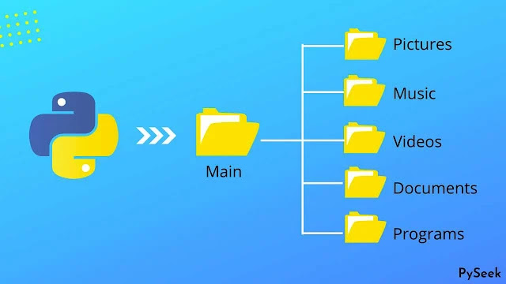

<div align="center">

# 📁 Downloads Papkasini Tartibga Soluvchi

**[🇺🇿 O'zbek tilida](README_UZ.md)** | **[In English 🇬🇧](README.md)**

**Downloads papkangizdagi fayllarni turi bo'yicha avtomatik tartiblaydigan dastur**



[](https://www.python.org/downloads/)
[](LICENSE)
[](https://github.com/psf/black)


</div>

---

Python dasturi, Downloads papkangizdagi fayllarni fayl turi bo'yicha avtomatik tartibga soladi. Faqat Python standart kutubxonasidan foydalanadi va takroriy fayllarni aqlli usulda qayta nomlaydi. Jarayon davomida batafsil statistik ma'lumotlar va hisobotlar taqdim etadi.

<div align="center">

## Xususiyatlar

</div>

- **Avtomatik tartiblash** - Fayllar o'z turlariga mos kategoriya papkalariga joylashtiriladi
- **Takroriy fayllarni boshqarish** - Takroriy fayllar avtomatik ravishda qayta nomlanadi
- **Statistika hisoboti** - Tartiblangan fayllar va takroriy fayllar haqida umumiy ma'lumot
- **Rejalashtirilgan avtomatlashtirish** - Har kuni, soatlab yoki belgilangan oraliqlarda avtomatik ishlaydi
- **Vaqt rejimida monitoring** - Downloads papkasini kuzatib turib, fayllar paydo bo'lganda darhol tartiblaydi
- **To'liq sharhlangan** - Oson tushunish va o'zgartirish uchun
- **Tez ishlash** - Samarali fayl boshqaruvi va progress tracking
- **Xavfsiz operatsiyalar** - Faqat Downloads papkasi ichida fayllarni ko'chiradi

<div align="center">

## 📂 Fayl kategoriyalari

</div>

Dastur fayllarni quyidagi papkalarga tartibga soladi:

| Kategoriya | Qo'llab-quvvatlanadigan kengaytmalar |
|----------|---------------------|
| 🖼️ **Rasmlar** | `.jpg`, `.jpeg`, `.png`, `.gif`, `.bmp`, `.svg`, `.webp`, `.ico`, `.tiff`, `.heic` |
| 🎥 **Videolar** | `.mp4`, `.avi`, `.mov`, `.mkv`, `.flv`, `.wmv`, `.webm`, `.m4v`, `.3gp` |
| 🎵 **Musiqa** | `.mp3`, `.wav`, `.flac`, `.aac`, `.ogg`, `.wma`, `.m4a` |
| 📄 **Hujjatlar** | `.pdf`, `.doc`, `.docx`, `.txt`, `.rtf`, `.xls`, `.xlsx`, `.ppt`, `.pptx`, `.csv` |
| 📦 **Arxivlar** | `.zip`, `.rar`, `.7z`, `.tar`, `.gz`, `.bz2`, `.xz`, `.iso` |
| ⚙️ **Ishga tushiruvchi fayllar** | `.exe`, `.msi`, `.dmg`, `.pkg`, `.deb`, `.rpm`, `.appimage` |
| 💻 **Kod** | `.py`, `.js`, `.html`, `.css`, `.java`, `.cpp`, `.c`, `.php`, `.rb`, `.go`, `.ts` |
| 🔤 **Shriftlar** | `.ttf`, `.otf`, `.woff`, `.woff2`, `.eot` |
| 📊 **Jadvallar** | `.csv`, `.xlsx`, `.xls`, `.ods` |
| 📽️ **Taqdimotlar** | `.pptx`, `.ppt`, `.odp` |
| ❓ **Boshqalar** | Yuqoridagi kategoriyalarga kirmaydigan fayl turlari |

<div align="center">

## Talablar

- **Python 3.6 yoki yuqori**
- **schedule** paketi (avtomatik rejalashtirish uchun)

---

## O'rnatish

</div>

```bash
git clone https://github.com/azizbek-web-dev/Python-Organize-downloads-folder-automatically.git
cd Python-Organize-downloads-folder-automatically
```

Kerakli paketni o'rnating:

```bash
pip install -r requirements.txt
```

## Foydalanish

### Asosiy foydalanish

```bash
python organize_downloads.py
```

### Maxsus papka yo'li

Boshqa papkani tartibga solish uchun, skriptni o'zgartiring va maxsus yo'lni kiriting:

```python
organizer = DownloadsOrganizer(downloads_path="C:/Users/YourName/Desktop/MyFolder")
organizer.organize_files()
```

### Avtomatik rejalashtirish

Tartibga soluvchini rejalashtirilgan tarzda ishga tushiring:

**Har kuni ma'lum vaqtda:**
```bash
python scheduler.py --mode daily --time 09:00
```

**Har soatda:**
```bash
python scheduler.py --mode hourly
```

**Har N soatda:**
```bash
python scheduler.py --mode interval --interval 12
```

**Haftada:**
```bash
python scheduler.py --mode weekly --time 09:00
```

To'xtatish uchun `Ctrl+C` tugmasini bosing

**Windows Task Scheduler (Kompyuter qaytadan yuklangandan keyin ham ishlaydi):**

Windows vazifasi sifatida avtomatik o'rnating:

```bash
# Administrator sifatida ishga tushiring
install_task_scheduler.bat
```

Bu har kuni ertalab 9:00 da vazifani yaratadi, hatto login qilmagan vaqtingizda ham ishlaydi.

### Vaqt rejimida monitoring

Downloads papkasini kuzatib turib, fayllar paydo bo'lishi bilan darhol tartiblaydi:

```bash
python watcher.py
```

Tekshirish orasini sozlang (sukut bo'yicha 2 soniya):
```bash
python watcher.py --interval 5
```

Bu Downloads papkasini doimiy kuzatib turadi va fayllar qo'shilganda darhol tartiblaydi.

**Watcher'ni Windows ishga tushishi bilan ishlatish uchun:**

Watcher'ni Windows ochilishi bilan avtomatik ishga tushiring:

```bash
# Administrator sifatida ishga tushiring
install_watcher_task.bat
```

Bu watcher'ni fon rejimida doimiy ishlaydigan qilib qo'yadi, kompyuter qaytadan yuklanganidan keyin ham yangi fayllarni kuzatib turadi.

---

<div align="center">

## Natija misoli

</div>


```
============================================================
Downloads folder organizer
============================================================

Organizing files in: C:\Users\YourName\Downloads
------------------------------------------------------------
document.pdf -> documents/document.pdf
image.jpg -> images/image.jpg
video.mp4 -> videos/video.mp4
Renamed duplicate: document.pdf -> document_1.pdf
------------------------------------------------------------
Organization summary:
  Total files found: 25
  Files organized: 25
  Duplicates renamed: 3
  Errors: 0

Your Downloads folder is now organized.
```

---

<div align="center">

## Qanday ishlaydi

</div>

Skript Downloads papkangizni tekshiradi, fayl turlarini kengaytma bo'yicha aniqlaydi, fayllarni kategoriya papkalariga tartibga soladi va takroriy fayllarni raqam qo'shib boshqaradi. Yakunda tartiblangan fayllar, qayta nomlangan takroriy fayllar va kuzatilgan xatolar haqida hisobot ko'rsatiladi.

<div align="center">

## Xavfsizlik xususiyatlari

</div>

- **Xavfsiz operatsiyalar** - Faqat Downloads papkasi ichida fayllarni ko'chiradi
- **Ma'lumotlar yo'qolmaysin** - Takroriy fayllar ustiga yozib ketmasdan qayta nomlanadi
- **Xatolarni boshqarish** - Ko'chirib bo'lmaydigan fayllarni nafis usulda boshqaradi
- **Struktura saqlanadi** - Downloads papkasi strukturasi saqlanadi

<div align="center">

## O'zgartirish

</div>

Skriptni o'zgartirish uchun `organize_downloads.py` faylidagi `FILE_CATEGORIES` lug'atini o'zgartiring:

```python
FILE_CATEGORIES = {
    'images': ['.jpg', '.jpeg', '.png', '.your-extension'],
    'your-category': ['.ext1', '.ext2'],
}
```

---

<div align="center">

## Eslatmalar

</div>

- Skript faqat Downloads papkasining asosiy katalogidagi fayllarni tartibga oladi, ichki papkalarga kirmaydi
- Kategoriya papkalaridagi mavjud fayllar o'chirilmaydi - takroriy fayllar avtomatik ravishda qayta nomlanadi
- Skriptni istalgan marta ishga tushirib, Downloads papkangizni tartibli saqlashingiz mumkin

---

<div align="center">

## Texnologiya stacki


**Tartibli downloads papkalari uchun ❤️ bilan yaratilgan**

</div>


